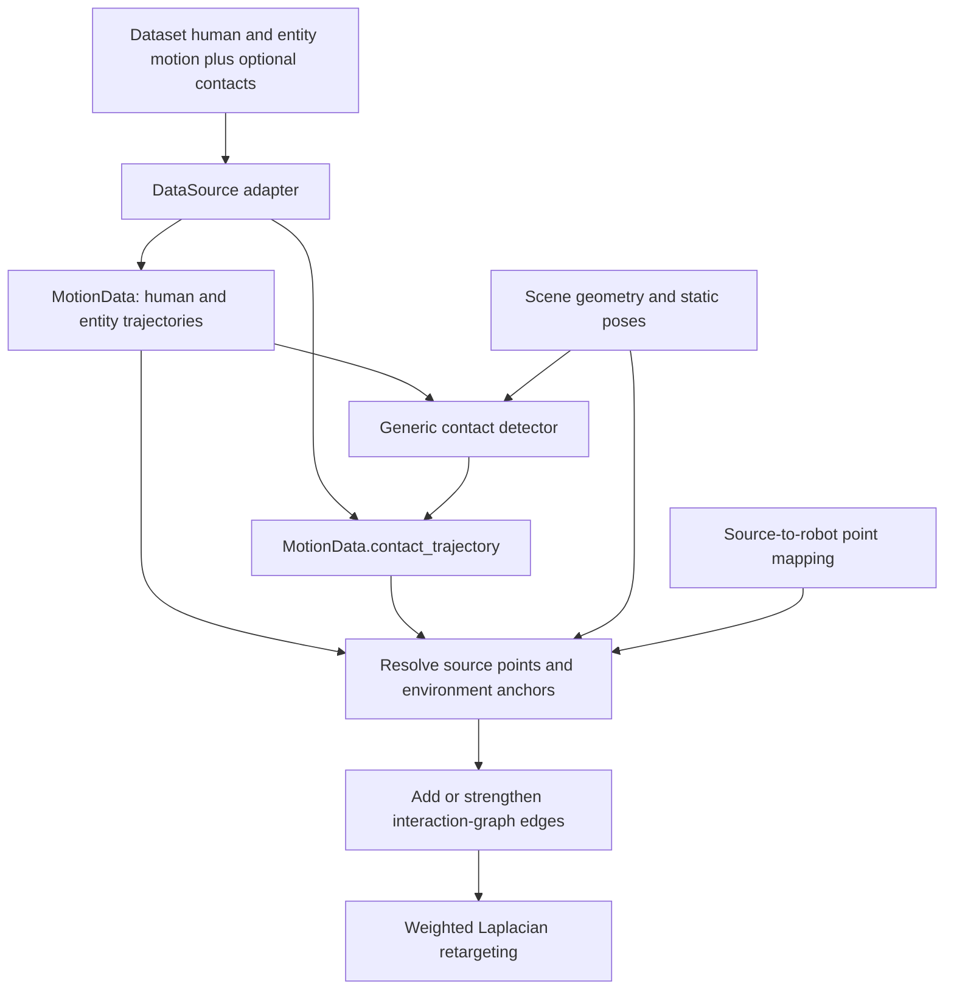

# Human-Scene-Object-Interaction (HSOI) Trajectory Interface

Status: implemented (2026-10-09). See `agents/PROGRESS.md` for verification and
`config_templates/omomo_contacts_example.yaml` / README for manual execution and
the concrete configuration choices. The design and original open decisions below
remain the reference for future interface tuning.

## Core Contract

**`MotionData` describes synchronized human motion, scene-entity motion, and contacts.**
Scene geometry stays separate and is referenced by entity ID. Any body point and
scene surface are supported; no foot/ground or `z=0` assumption.

```text
MotionData
├─ positions / target_names             human target motion
├─ root_translations / orientations     human root motion
├─ framerate                            shared timeline
├─ entity_trajectories (optional)
│  └─ [entity_id]
│     ├─ translations    (T, 3)
│     └─ orientations    (T, 4)
└─ contact_trajectory (optional)
   └─ [frame t]                       variable-length list of contacts, or None
      └─ Contact
         ├─ source_point_id ────────> human contact point
         ├─ scene_body_id ──────────> scene rigid body
         └─ point_local (3,)

Scene
└─ entities[entity_id]
   ├─ geometry / local surface samples
   └─ static pose                      when no trajectory is supplied
```

`T` = motion frames. Each frame's contact count can differ.
Source identifiers are robot-independent.
All trajectories share frame count, timestamps, world frame, and length units.

## Entity Trajectories

Use `entity_trajectories` for objects, moving platforms, or moving terrain sections.
Each trajectory references scene geometry and shares the human frame timeline.
Contactable entities identify individual rigid bodies. An articulated object's
links have distinct IDs and resolved world poses, e.g. `cabinet/door`.
`Contact.scene_body_id`, scene entity keys, and trajectory keys share the same ID namespace.

| Entity data | Shape | Meaning |
|---|---|---|
| `entity_id` | mapping key | Stable rigid-body ID shared with scene and contacts |
| `translations` | `(T, 3)` | Entity origin in world coordinates |
| `orientations` | `(T, 4)` | Local-to-world unit quaternions; proposed `wxyz` convention |

```text
static wall       → Scene.entities[wall].static_pose
carried box       → MotionData.entity_trajectories[box][t]
moving platform   → MotionData.entity_trajectories[platform][t]
```

A supplied trajectory defines the entity pose at each frame; otherwise use its
explicit static pose. Both resolve the same body-local geometry frame. Missing
body/pose references are errors, rather than assumed identity transforms.

New scene samples are body-local. Existing OMOMO `MotionData.object_points` are
already world-space `(T, N, 3)` samples; applying a pose again would transform them
twice. Its pose/scale metadata needs an explicit migration path.

Constant object scale can be baked into geometry and contact coordinates.
Time-varying scale/deformation cannot be represented by rigid poses alone and
must be addressed explicitly before migrating such data.

## Contact Trajectory

**A temporal sequence whose item at frame `t` is a variable-length list of contacts.**
The outer list has exactly `T` entries, aligned with `MotionData.positions`.

```python
# Proposed MotionData field; Contact is one detected contact:
contact_trajectory: list[list[Contact] | None] | None = None
```

Each `Contact` contains:

| Field | Shape / type | Meaning |
|---|---|---|
| `source_point_id` | ID | Source target or explicitly defined body contact point |
| `scene_body_id` | ID | Contacted rigid body; resolves to a scene entity |
| `point_local` | `(3,)` | Surface contact location in the contacted body's frame |
| `confidence` (optional) | scalar | Detection confidence in `[0, 1]`, separate from binary state |
| `normal_local` (optional) | `(3,)` | Contacted-body-local surface normal |

Contact presence represents contact = 1 in the supplied result. Every contact has
finite coordinates and resolvable endpoints; optional confidence is finite and in
`[0, 1]`, and optional normals are finite unit vectors. Empty contact lists are valid.

Source-point IDs resolve to unique `MotionData.target_names` and their positions.
Adapters can expose body-surface markers as additional named targets. Graph use
requires an explicit mapping to robot link points. When contact weighting is
enabled, a missing mapping raises an error naming the source point. A body-part
label alone is insufficient.

### Contact Identity

Each contact stores its own pair: `(source_point_id, scene_body_id)`.
Pairs can change freely between frames; no persistent `contact_id` or `track_ids`
is required by the initial interface.

| Identifier | Meaning across time |
|---|---|
| `source_point_id` | Stable human contact-point identity |
| `scene_body_id` | Stable scene rigid-body identity |
| List position `(t, i)` | One observation in frame `t`; no temporal identity |

```text
frame 0: palm ↔ box
frame 1: palm ↔ wall       scene endpoint changes
frame 2: knee ↔ wall       human endpoint changes
```

Temporal correspondence for filtering/resampling is a separate policy. A repeated
pair alone does not establish a continuous contact episode or surface attachment.

```text
contact_trajectory = None    → annotations unavailable for the sequence
contact_trajectory[t] = None → annotations unavailable for frame t
contact_trajectory[t] = []   → no detected contacts at frame t
contact_trajectory[t] = [...]→ detected contacts at frame t
```

An empty result does not certify that every possible human-scene pair was checked.
Candidate selection and thresholds belong to detector configuration.

## Temporal Sequence Example

```text
contact_trajectory = [
    [palm ↔ box, knee ↔ platform],  # t=0: two contacts
    [palm ↔ cabinet/door],         # t=1: one contact, changed pair
    [],                           # t=2: no detected contacts
    None,                         # t=3: unavailable
]

T = 4; frame contact counts = [2, 1, 0, unavailable].
Storage grows with frames + actual contacts, not all possible pairs.
```

One point can contact multiple bodies; multiple points can contact the same body.
Distinct anchors may share a pair; pair IDs alone do not uniquely identify a record.
The current solver merges duplicate pair/anchor observations with maximum
confidence, then represents each pair's distinct active anchors by one
confidence-weighted centroid with mean confidence. This prevents patch density
from adding reverse Laplacian residual rows. Stored surface annotations retain
all original anchors; the graph representative need not lie on a curved surface.

## Shared Coordinate Frames

```text
environment-local point ── entity pose at t ──> world point

contact = contact_trajectory[t][i]
body = contact.scene_body_id
p_world = R_body(t) @ contact.point_local + translation_body(t)

                    t0       t1       t2
Sticking p_local:   a        a        a       same location
Sliding  p_local:   a ─────> b ─────> c       changing location
```

Static terrain uses a constant entity pose; moving objects use changing poses.
The same transform places both entity geometry and contact anchors in the world.
Contact points are scene-surface anchors, which may differ from human joint centers.
Normals rotate with the body pose; translation does not affect them.
Optional per-record face indices + barycentric coordinates could identify mesh
attachments. Deforming geometry remains outside the agreed design.

## Production and Retargeting



```text
source node ── contact-weighted edge ── environment node / contact anchor

for each active source-point/scene-body pair:
    extra weight = configured_weight × aggregated_confidence
                                       (1 when all confidences are absent)
```

No contact edge is contributed by an absent record. Ordinary spatial edges remain.
Combine spatial/contact contributions before row normalization. Pass the same
normalized weights to source Laplacian coordinates and the robot Laplacian matrix;
scaling a whole normalized row alone cannot strengthen its relative contact share.

Resolve environment nodes within the contacted body, never by an unrestricted
nearest-scene search. Inserted anchors must appear in identical source/robot node
order and environment Jacobian rows. Environment positions vary across frames but
are fixed within a frame's robot solve, so their Jacobian rows are zero.
Freeze that frame's graph and weights across solver iterations. Aggregate
pair/anchor records using the policy above before constructing the graph.
Edge weighting alone does not enforce exact attachment or prevent penetration.
Detection thresholds belong to detector config; graph weights belong to solver config.
Source-specific body-model internals stay in adapters/detection helpers.

## Motion Operations

| Operation | HSOI behavior |
|---|---|
| Copy / slice | Copy/slice aligned frame lists and contact coordinates; preserve None and [] |
| Batch ↔ `MotionFrame` | Carry entity poses and that frame's contact list or None |
| Resample motion | Shared times; interpolate translations and SLERP orientations |
| Resample contacts | Copy nearest source frame's contact list or None |
| Uniform scale | Scale points, scene geometry, and translations consistently |
| Change world frame | Transform human motion, entity trajectories, and static poses; retain local contact points |

Initial contact resampling uses the shared destination time grid, with earlier
source frame winning ties. Copy local anchors/confidence with the selected
observations; do not interpolate list positions or changing pairs. This is a
discrete approximation and may omit short events. Re-detection after resampling
is an explicit alternative; interpolation requires separate temporal correspondence.

Uniform scaling also updates static body translations and local samples; rotations,
normals, IDs, and availability stay unchanged. Resampling/scaling must preserve
these fields at every `MotionData` reconstruction in `core.py` and DataSource loading.

## Consistency Review

| Finding | Resolution |
|---|---|
| Sparse identity and changing pairs | Consistent: each record owns its endpoints; no temporal contact ID |
| Empty versus unavailable frames | [] reports no detected contacts; None marks missing annotations |
| Body labels did not provide source geometry | Resolve named targets and explicit robot point mappings |
| Legacy samples could be transformed twice | Separate existing world samples from new local geometry |
| Resampling promised continuity without correspondence | Whole-frame nearest sampling; short-event loss documented |
| Contact strength depends on Laplacian normalization | Combine raw edge contributions, normalize, then reuse the same graph |

## Implementation Tasks and Acceptance

| Task | Required behavior |
|---|---|
| Define data types | Define Contact fields; validate outer length T, IDs, coordinates, and rigid-body poses |
| Integrate motion operations | Batch/frame round-trip, copy/slice, shared resampling, and scaling preserve annotations |
| Bridge current scene inputs | Map legacy world samples, object pose/scale metadata, and static terrain explicitly |
| Connect graph construction | Resolve source/body points and anchors; reuse node order and normalized weights |
| Add detector/adapter annotations | Emit per-frame contact lists, [] or None, with explicit detector configuration |

Original acceptance cases: all-empty lists; unavailable vs empty frames; changing/simultaneous
pairs; articulated body IDs; moving, sticking, and sliding contacts; sparse annotation
round-trip; consistent scaled anchors; no invented cross-pair interpolation; matching
source/robot Laplacian graph and environment rows. Verified implementation results
are recorded separately in `agents/PROGRESS.md`.

## Open Decisions

| Area | Still to choose |
|---|---|
| Storage | Concrete Contact type, ID encoding, frame view, serialization |
| Scene | Entity lookup and migration from `object_points`, `object_mesh`, pose metadata |
| Body points | Selection of additional named markers and robot link-point offsets |
| Detection | Geometry, sampling, thresholds, filtering, confidence semantics |
| Resampling | Optional correspondence/interpolation or re-detection beyond nearest sampling |
| Graph | Anchor insertion vs sample association; relative weights and repeated-edge aggregation |

From the prior `hoi-retarget` review: retain binary contact semantics and local
points as precedents. Its dense flags, robot-specific contacts, and separate costs
do not define this interface or the planned Laplacian integration.
